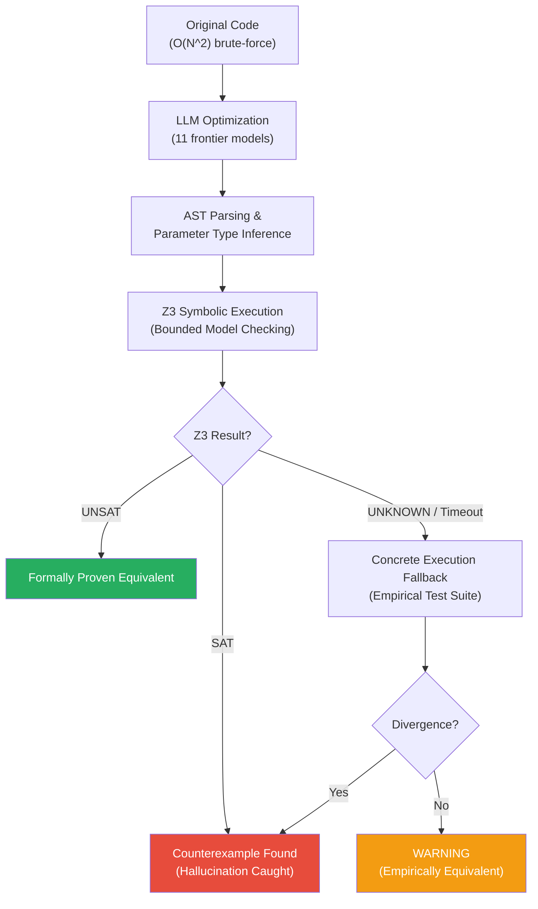

<p align="center">
  <h1 align="center">Tyr</h1>
  <p align="center">
    <strong>A Hybrid Formal Verification Framework for LLM-Generated Code Optimizations</strong>
  </p>
  <p align="center">
    <a href="https://www.python.org/"></a>
    <a href="https://github.com/Z3Prover/z3"></a>
    <a href="https://marketplace.visualstudio.com/"></a>
    <a href="LICENSE"></a>
  </p>
</p>

---

> **When an LLM says it "optimized" your code, did it preserve correctness?**
>
> Tyr answers that question with mathematical proof. It combines Bounded Model Checking via the Z3 theorem prover with a concrete execution fallback to catch semantic hallucinations in LLM-generated code -- before they reach production.

## Key Findings

Across **2,750 experiments** (11 frontier models x 250 problems), Tyr formally caught **557 semantic hallucinations** -- cases where models returned code that looked correct but silently changed behavior:

| Model | Hallucinations Caught (SAT) | Failure Rate |
|:------|:---------------------------:|:------------:|
| Meta-Llama-3.1-405B-Instruct | 88 / 250 | **35.2%** |
| Grok-3 | 67 / 250 | 26.8% |
| Codestral-2501 | 58 / 250 | 23.2% |
| DeepSeek-V3-0324 | 53 / 250 | 21.2% |
| o4-mini | 52 / 250 | 20.8% |
| o3 | 47 / 250 | 18.8% |
| GPT-4.1 | 46 / 250 | 18.4% |
| DeepSeek-R1-0528 | 42 / 250 | 16.8% |
| Gemini-2.5-Flash | 41 / 250 | 16.4% |
| Gemini-2.5-Pro | 37 / 250 | 14.8% |
| **GPT-5** | **26 / 250** | **10.4%** |

Even GPT-5, the best-performing model, still produced semantically incorrect "optimizations" in 1 out of every 10 problems.

## How It Works

Tyr operates as a two-stage verification pipeline:



**Stage 1 -- Symbolic Verification (Z3 BMC):**
The original and LLM-generated functions are translated into Z3 constraints via AST-level symbolic execution. Z3 searches for any input within the bounded domain (arrays up to 5 elements, integers in bounded ranges) where the two functions produce different outputs.

**Stage 2 -- Concrete Fallback:**
When Z3 returns `UNKNOWN` (timeout, unsupported constructs), Tyr falls back to empirical testing with curated edge-case inputs -- boundary values, empty lists, single-element arrays, and random samples.

**Counterexample-Guided Self-Correction (CGSC):**
When used interactively (via the API or VS Code extension), Tyr feeds discovered counterexamples back to the LLM, allowing up to 3 correction rounds before reporting a final verdict.

## Repository Structure

```
tyr/
|-- backend/                        # Core verification engine
|   |-- main.py                     #   FastAPI server + CGSC loop
|   |-- config.py                   #   BMC bounds, timeouts, sentinels
|   |-- llm_service.py              #   LLM API integration (Groq)
|   |-- symbolic/                   #   AST-to-Z3 translator
|   |-- verifier/                   #   Equivalence checker + concrete fallback
|   `-- tests/                      #   Regression test suite
|
|-- src/
|   |-- generators/                 # Stage 1: LLM code generation
|   |   `-- generate_llm_benchmark.py
|   `-- evaluators/                 # Stage 2: Formal verification
|       `-- verify_llm_results.py
|
|-- scripts/
|   `-- build_dataset.py            # Generates tyr_benchmark_250.json
|
|-- data/
|   |-- benchmarks/                 # 250 hand-curated O(N^2) problems
|   |   `-- tyr_benchmark_250.json
|   |-- raw/                        # Stage 1 output (11 CSVs)
|   `-- verified/                   # Stage 2 output (11 CSVs) + analysis tools
|       |-- *.csv                   #   Verified results per model
|       |-- analyze_metrics.py      #   Per-model summary statistics
|       |-- generate_graphs.py      #   Publication-ready comparison chart
|       `-- find_bug.py             #   SAT case inspector
|
`-- vscode-extension/               # VS Code integration with WebView UI
    `-- src/extension.ts
```

## Quick Start

### 1. Clone and install

```bash
git clone https://github.com/<your-username>/tyr.git
cd tyr
```

Create and activate a virtual environment:

```powershell
# Windows (PowerShell) — use the official Python installer, NOT MSYS2/MinGW
python -m venv .venv
.\.venv\bin\Activate.ps1
```

```bash
# macOS / Linux
python3 -m venv .venv
source .venv/bin/activate
```

Install dependencies:

```bash
pip install -r backend/requirements.txt
pip install tqdm python-dotenv openai google-genai pandas matplotlib numpy
```

> **Windows users:** If `z3-solver` or `numpy` fails to build, you are likely using MSYS2/MinGW Python instead of the [official CPython installer](https://www.python.org/downloads/). Verify with `python -c "import sys; print(sys.executable)"` -- it should show `AppData\Local\Programs\Python\`, not `msys64\`.

### 2. Configure API keys

Create a `.env` file in the project root:

```env
# GitHub Models (powers 9 of 11 benchmark models via Azure AI Inference)
GITHUB_TOKEN=your-github-pat-here

# Google Gemini (for gemini-2.5-pro, gemini-2.5-flash)
GEMINI_API_KEY=your-gemini-key-here
```

### 3. Run the verification engine

```bash
# Start the Tyr backend server
cd backend
uvicorn main:app --host 0.0.0.0 --port 8000
```

```bash
# Verify a single code pair via the API
curl -X POST http://localhost:8000/verify \
  -H "Content-Type: application/json" \
  -d '{"code": "def two_sum(nums, t):\n  for i in range(len(nums)):\n    for j in range(i+1,len(nums)):\n      if nums[i]+nums[j]==t: return 1\n  return 0"}'
```

### 4. Reproduce the benchmark

```bash
# Stage 1: Generate LLM solutions (all 11 models)
python src/generators/generate_llm_benchmark.py --suite all

# Stage 2: Verify all results with Tyr
python src/evaluators/verify_llm_results.py --all

# Analyze results
cd data/verified && python analyze_metrics.py
```

## Detailed Guides

| Guide | Description |
|:------|:------------|
| [Benchmark Pipeline](docs/BENCHMARK_GENERATION.md) | Running Stage 1 (LLM generation) and Stage 2 (formal verification) |
| [Analysis & Graphs](docs/GRAPH_GENERATION.md) | Reproducing charts and statistics from verified results |

## Verification Bounds

Tyr uses Bounded Model Checking, which means verification is exhaustive **within defined bounds**:

| Parameter | Default | Description |
|:----------|:-------:|:------------|
| `MAX_BMC_LENGTH` | 5 | Maximum list length in symbolic domain |
| `MAX_SYMBOLIC_RANGE` | 10 | Maximum `range()` iterations in for-loops |
| `MAX_LOOP_UNROLL` | 30 | Maximum while-loop unroll depth |
| `Z3_TIMEOUT_MS` | 10,000 | Z3 solver timeout (milliseconds) |
| `CONCRETE_EXEC_TIMEOUT_S` | 5 | Per-function execution timeout in fallback |
| `MAX_CORRECTION_ROUNDS` | 3 | CGSC self-correction attempts |

These can be overridden via environment variables (e.g., `TYR_MAX_BMC_LENGTH=8`).

## VS Code Extension

The Tyr VS Code extension provides one-click verification from your editor:

1. Select a Python function in the editor
2. Right-click and choose **Tyr: Optimize & Verify**
3. View the result in a rich WebView panel with:
   - Side-by-side diff of original vs. optimized code
   - Formal verification verdict with counterexample details
   - Big-O complexity comparison
   - Full CGSC audit trail

Requires the Tyr backend running locally (`uvicorn main:app --port 8000`).

## Citation

If you use Tyr in your research, please cite:

```bibtex
@misc{tyr2025,
  title   = {Tyr: A Hybrid Formal Verification Framework for LLM-Generated Code Optimizations},
  author  = {Pankaj Kumar Bind},
  year    = {2025},
  url     = {https://github.com/<your-username>/tyr}
}
```

## License

This project is licensed under the MIT License. See [LICENSE](LICENSE) for details.
